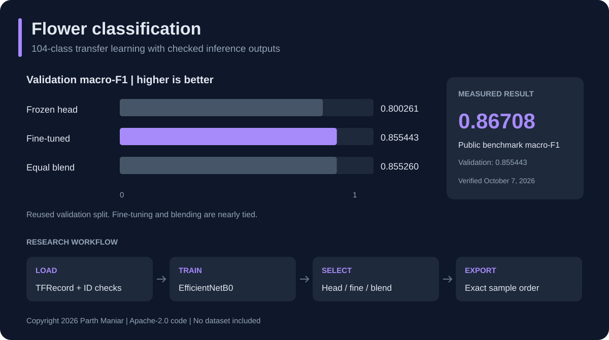

# Flower classification

 

Copyright 2026 Parth Maniar. Apache-2.0.
[GitHub](https://github.com/officialpm) | [Portfolio](https://www.parthmaniar.tech/)

A GPU transfer-learning project for 104-class flower recognition. It compares a frozen feature extractor, a fine-tuned classifier, and an equal probability blend, then checks prediction IDs before writing output.

This is an evaluated model workflow, not a deployed flower-identification product. A camera app or inference service is a possible future extension, not part of this release.



## Measured results

| Model | Validation macro-F1 | Validation accuracy |
|---|---:|---:|
| Frozen head | 0.800261 | 0.823276 |
| Fine-tuned model | **0.855443** | **0.878502** |
| Equal blend | 0.855260 | 0.873653 |

The fine-tuned candidate scored **0.86708 public macro-F1** on October 7, 2026. Validation and public scores are different measurements. Model selection reused the validation split; the fine-tuned and blended results differ only slightly. [Results and provenance](RESULTS.md).


## Workflow

1. Verify TFRecord feature names, counts and all 104 training/validation classes.
2. Load ImageNet-pretrained EfficientNetB0 at 224 pixels with flip, rotation and zoom augmentation.
3. Train a frozen head for three epochs, then fine-tune at a lower learning rate for up to eight epochs. BatchNorm layers stay frozen.
4. Save best validation-loss checkpoints; report macro-F1, accuracy and log loss for every declared candidate.
5. Match test IDs exactly to the sample order. Reject duplicates, missing IDs, nonfinite probabilities or labels outside 0-103.

## Run locally

The measured run used TensorFlow 2.20, Python 3.13.15 and two Tesla T4 GPUs. The portable script requires a working TensorFlow GPU environment; it intentionally refuses long CPU training. GPU setup is platform-specific.

Obtain the authorized TFRecord dataset yourself. Under `data/`, keep the `tfrecords-jpeg-224x224/train`, `val` and `test` folders plus `sample_submission.csv`.

```bash
python -m venv .venv
source .venv/bin/activate
python -m pip install -r requirements.txt
python train.py
```

Set `FLOWER_DATA_DIR` and `FLOWER_OUTPUT_DIR` for other folders. The first run downloads ImageNet weights from the Keras distribution. It writes both checkpoints, validation/test probability arrays, per-class metrics, a checked prediction CSV and a manifest. Nothing submits automatically.

`train.py` is a portable adaptation and has passed syntax checks, not a new full training run. The notebook calls the portable script so the executable source stays in one place. Exact GPU results may vary across versions and hardware.

## Project map

| File | Purpose |
|---|---|
| `train.py` | Portable GPU training and checked inference |
| `workflow.ipynb` | Notebook entry point |
| `RESULTS.md` | Score ledger, measured environment and limits |
| `requirements.txt` | TensorFlow pin and dependency ranges |
| `LICENSE`, `NOTICE` | Code license and attribution |

## Limits and credit

The official validation split is reused for checkpointing and model selection. No duplicate-image purge or independent unseen-domain test was performed. ImageNet ancestry may overlap with publicly available flower imagery. Test labels were not fetched, matched or copied. This benchmark's discoverable public labels make perfect leaderboard claims especially unreliable; the score here comes from model training.

Original implementation and documentation: Parth Maniar. Apache-2.0 covers code, not images. Dataset creators and third-party libraries retain their rights. No image dataset, checkpoint, test prediction file or credential is published here.

Schema and split layout were informed by Ryan Holbrook's Apache-2.0 starter; EfficientNet input scale and BatchNorm handling follow Keras documentation.

[TensorFlow TFRecord guide](https://www.tensorflow.org/tutorials/load_data/tfrecord) | [Keras EfficientNet](https://keras.io/api/applications/efficientnet/) | [Transfer learning](https://keras.io/guides/transfer_learning/)
